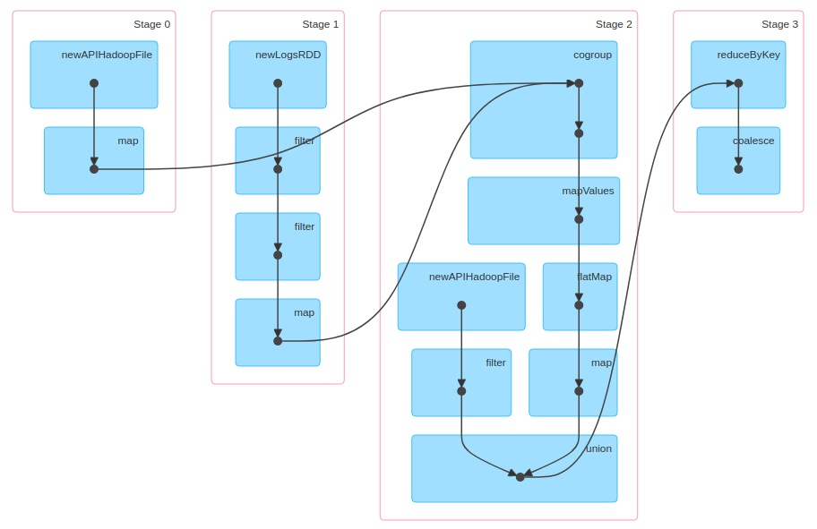

# Simple Spark

Have you ever wondered how Apache Spark and Beam work under the cover? Both Spark and Beam are high-performance, parallel-data processing frameworks generally run on a compute cluster. Basically, they are useful for ETL on "Big Data" to maximize throughput, minimize latency, and ideally reduce the prototyping cycle.  
 
Parallelism can occur at the **chip** level: Single instruction, multiple data (SIMD) instructions can utilize the full width of the registers on a CPU (NumPy) and GPU (TensorFlow).  

Parallelism can also occur at the **process** level using libraries such as `multiprocessing`, `ipyparallel`, and `MRJob`. You can take a look at my comparision between ipyparallel and MRJob: https://github.com/eugeneh101/ipyparallel-vs-MRJob.  
Note that multiprocessing is not equivalent to multithreading. Multiprocessing can utilize multiple CPUs, since multiprocessing spawns multiple Python kernels that have separate memory spaces and thus bypassing the Global Interpreter Lock (GIL). Multiprocessing yields performance and runtime gains when your computations are CPU bound. On the other hand, multithreading is useful when your program is IO bound. Threads are less resource intensive than processes and achieve concurrency by context switching between threads very quickly. However, only 1 CPU is running at any given time, as the GIL is still in effect. You can take a look at my threading walkthrough that emulates a Publish-Subscriber pattern: https://github.com/eugeneh101/Concurrency-with-Threading.  

Parallelism can also occur at the **machine** level where multiple machines work cooperatively in a cluster--that's what Spark and Beam do.  
 
I'm deeply curious about the implementation underlying Spark in which you chain a bunch of transformations to create a Directed Acyclic Graph (DAG). The graph is defined lazily, so the actual computation is deferred until an action is called. 

## Objective
In this repo, I focus on implementing the lazy transformation DAG (ie. how do you perform a `groupByKey()` in a lazy way?). Often times, people say that Spark performs computations in memory. However, the secret sauce is how Spark uses memory intelligently and efficiently. Spark applies transformations to elements in a depth-first manner where the first element will pass through the first transform all the way to the last transform. And only then does the second element began its transformation. With some oversimplification, Spark aims to limit memory usage by keeping only 1 element in memory at a time instead of reifying the entire collection simultaneously at every step of the transformation. The only exception is when Spark hits a "fusion" transformation (such as `groupByKey()`) where all elements are required to be reified up to that point before further transformations can take place.  

The annotations below explain the pros and cons for each of my implementations, which are ordered from simplest to most sophisticated and complete. My notebook requires Python 3.3+. Enjoy!  

Disclaimer: This repo does not focus on the parallelized nature of computation across machines.
  

#### 1st Attempt
Pros: 
* simple generator style to create transforms
  
Cons: 
* only works for first action. Once called, no further actions can be performed

#### 2nd Attempt
Pros:
* 2nd implemention using generator style
* slight improvement in that calling an action the second time will return non-empty list. 

Cons: 
* still suffers from the same problem of only can perform (correct) action 1 time
* only the transformations up to the last transformation are applied--cannot get the correct result from action for first transformation if there exists a second transformation

#### 3rd Attempt
Pros:
* decorator style: composing higher order functions to emulate the sequence of transformations
* added `reduce()` action
* can create multiple RDDs where actions will get you the correct result
* decoupled the RDDs, hence RDDs are immutable

Cons:
* cannot do `filter()` or `groupByKey()` due to the inherent limitation of using decorators

#### 4th Attempt
Pros:
* instead of generator or decorator, implemented RDD transformations as a list of map functions

Cons:
* `reduceByKey()`, `filter()`, and `groupByKey()` not implemented

#### 5th Attempt
Pros:
* 2nd implementation using a list of functions and generator function
* `reduceByKey()` transformation implemented
* `filter()` transformation implemented weakly
* attempted to implement `flatMap()`

Cons:
* `reduceByKey()` uses `groupByKey()`, which creates a dictionary with keys and lists of values. Hence, memory usage can spike if the list of values corresponding to its key is very large
* `filter()` doesn't work if transformed element is falsy (False, 0, "")
* `flatMap()` doesn't work correctly due to limitation of how `__results_generator__()` iterates though elements in RDD

#### 6th Attempt (Best Implementation)
Pros:
* 3rd implementation using a list of functions (and recursive generator function)
* superior implementation of `reduceByKey()` where two values for a given key is immediately reduced into 1 value. Hence, each key will always have exactly 1 value
* superior implementation of `filter()` transformation using the recursive generator function `__results_generator__()`
* `flatMap()` implementation fixed using the recursive generator function `__results_generator__()`

Cons:
* can only reify (call an action on) an inputted generator 1 time--if you `parallelize()` a generator, then the second time you call an action, an empty list will be returned. Only a weakness for generators as they can only be iterated through once. If you `parallelize()` a list or tuple, then the second time you call an action, the correct answer will be returned.

#### 7th Attempt
Pros:
* 4th implementation using a  list of functions (and recursive generator function)
* even if you `parallelize()` a generator, the second time you call an action, RDD will return the correct result. After the first reify, the generator (that you `parallelize()`) is memoized as a list
* Moved the type checking (whether if the current RDD's `__sequence__` is a (generator) function, generator, or container) from `__results_generator__()` to `__sequence_generator__()`

Cons:
* despite being more complete than the 6th implementation, it is harder to read